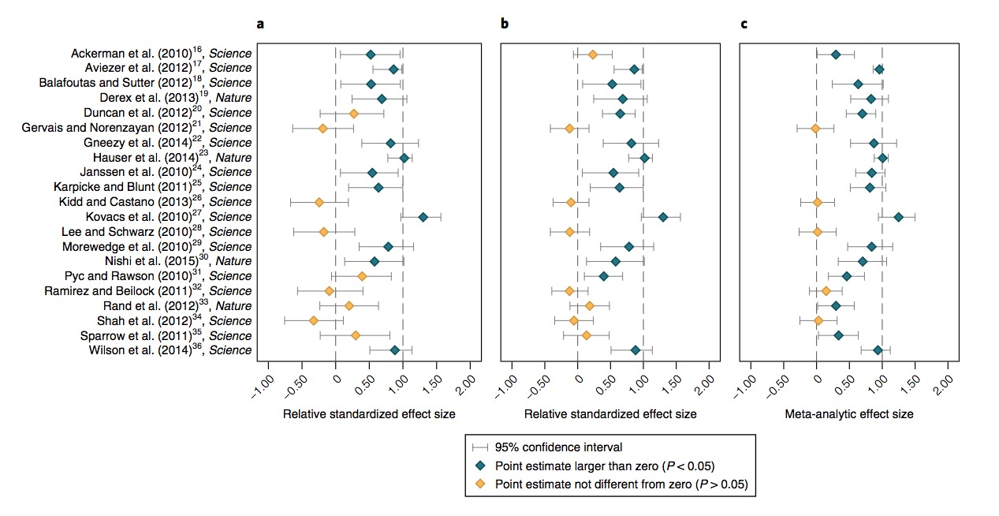

```{r setup, include=FALSE}
knitr::opts_chunk$set(echo = FALSE, 
                      fig.align = 'center', 
                      out.width = '100%')
```

# Discussion of

Camerer, C. F., Dreber, A., Holzmeister, F., Ho, T.-H., Huber, J., Johannesson, M., Kirchler, M., et al. (2018). Evaluating the replicability of social science experiments in Nature and Science between 2010 and 2015. *Nature Human Behaviour*, *1*. Nature Publishing Group. Retrieved August 28, 2018, from https://www.nature.com/articles/s41562-018-0399-z

Commentary: <https://www.theatlantic.com/science/archive/2018/08/scientists-can-collectively-sense-which-psychology-studies-are-weak/568630/>

Project on OSF: <https://osf.io/pfdyw/>

## Supplemental Information

<style>.embed-responsive{position:relative;height:100%;}.embed-responsive iframe{position:absolute;height:100%;}</style><script>window.jQuery || document.write('<script src="//code.jquery.com/jquery-1.11.2.min.js">\x3C/script>') </script><link href="https://mfr.osf.io/static/css/mfr.css" media="all" rel="stylesheet"><div id="mfrIframe" class="mfr mfr-file"></div><script src="https://mfr.osf.io/static/js/mfr.js"></script> <script>var mfrRender = new mfr.Render("mfrIframe", "https://mfr.osf.io/render?url=https://osf.io/sva2k/?action=download%26mode=render");</script>

# Background

## Reproducibility Project: Psychology (RPP)

Open Science Collaboration. (2015). Estimating the reproducibility of psychological science. Science, 349(6251), aac4716–aac4716. American Association for the Advancement of Science. Retrieved February 17, 2017, from http://science.sciencemag.org/content/349/6251/aac4716

> "We conducted replications of 100 experimental and correlational studies published in three psychology journals using high-powered designs and original materials when available....The mean effect size (r) of the replication effects (Mr = 0.197, SD = 0.257) was half the magnitude of the mean effect size of the original effects (Mr = 0.403, SD = 0.188), representing a substantial decline. Ninety-seven percent of original studies had significant results (P < .05). Thirty-six percent of replications had significant results; 47% of original effect sizes were in the 95% confidence interval of the replication effect size; 39% of effects were subjectively rated to have replicated the original result; and if no bias in original results is assumed, combining original and replication results left 68% with statistically significant effects."

## Studies are underpowered

<div class="centered">


<small>([Szucs & Ioannides, 2017](http://doi.org/10.1371/journal.pbio.2000797))</small>
</div>

---

<div class="centered">
> "Assuming a realistic range of prior probabilities for null hypotheses, false report probability is likely to exceed 50% for the whole literature."

<small>([Szucs & Ioannides, 2017](http://doi.org/10.1371/journal.pbio.2000797))</small>
</div>

## Many Labs Project

What is the sampling distribution of effect sizes under replication?


Klein, R. A., Ratliff, K. A., Vianello, M., Adams, R. B., Bahník, Š., Bernstein, M. J., Bocian, K., et al. (2014). Investigating variation in replicability: A “many labs” replication project. Social psychology, 45(3), 142–152. Retrieved April 6, 2016, from http://econtent.hogrefe.com/doi/abs/10.1027/1864-9335/a000178

## Many Babies


Frank, M. C., Bergelson, E., Bergmann, C., Cristia, A., Floccia, C., Gervain, J., Hamlin, J. K., et al. (2017). A collaborative approach to infant research: Promoting reproducibility, best practices, and theory-building. Infancy: the official journal of the International Society on Infant Studies. Wiley Online Library. Retrieved from http://onlinelibrary.wiley.com/doi/10.1111/infa.12182/full

# What did they do?

- High-powered (90% power to effects smaller than original) replications of $n=21$ studies published in *Science* and *Nature* between 2010-2015
- "...all experimental studies published between 2010 and 2015 that (1) test for an experimental treatment effect between or within subjects, (2) test at least one clear hypothesis with a sta- tistically significant finding, and (3) were performed on students or other accessible subject pools."
- Phase I 90% power to detect $0.75d_{orig}$; Phase II 90% power to detect $0.5d_{orig}$
- "...replication sample sizes in stage 1 were about three times as large as the original sample sizes and replication sample sizes in stage 2 were about six times as large as the original sample sizes."
- "...replication and analysis plans were made publicly known on the project website, pre-registered at the Open Science Framework (OSF) and sent to the original authors for feedback and verification prior to data collecion..."

# What did they find

## Replication studies

```{r, fig.cap="Camerer et al. Fig 1"}

```

```{r}

```

```{r, fig.cap="Camerer et al. Fig 2"}
knitr::include_graphics("img/camerer-2018-fig-2.jpg")
```

```{r}

```

```{r, fig.cap = 'Camerer et al. Supplemental Fig 4'}
knitr::include_graphics("https://mfr.osf.io/export?url=https://osf.io/vew97/?action=download%26mode=render%26direct%26public_file=True&initialWidth=680&childId=mfrIframe&parentTitle=OSF+%7C+S4+-+CorrelationEffectSizes.png&parentUrl=https://osf.io/vew97/&format=2400x2400.jpeg")
```

## Prediction markets

```{r, fig.cap = 'Camerer et al. Fig 5'}
knitr::include_graphics("https://mfr.osf.io/export?url=https://osf.io/cefq7/?action=download%26mode=render%26direct%26public_file=True&initialWidth=680&childId=mfrIframe&parentTitle=OSF+%7C+F4+-+PeerBeliefs.png&parentUrl=https://osf.io/cefq7/&format=2400x2400.jpeg")
```

```{r, fig.cap = 'Camerer et al. Supplemental Fig 6'}
knitr::include_graphics("https://mfr.osf.io/export?url=https://osf.io/teprz/?action=download%26mode=render%26direct%26public_file=True&initialWidth=680&childId=mfrIframe&parentTitle=OSF+%7C+S6+-+TradingInterface.png&parentUrl=https://osf.io/teprz/&format=2400x2400.jpeg")
```

```{r, fig.cap = 'Camerer et al. Supplemental Fig 8'}
knitr::include_graphics("https://mfr.osf.io/export?url=https://osf.io/wp38a/?action=download%26mode=render%26direct%26public_file=True&initialWidth=680&childId=mfrIframe&parentTitle=OSF+%7C+S8+-+PeerBeliefsEffectSize.png&parentUrl=https://osf.io/wp38a/&format=2400x2400.jpeg")
```

## Summary

- significant effect in same direction for 13 (62%) studies
- effect size ~50% of the original
- replicability between 12 (57%) and 14 (67%) from complementary replicability indicators
- estimated true-positive rate is 67% in a Bayesian analysis
- prediction market valuations corresponded to 'success' of replication efforts

# Issues

- Defining replication 'success'
- "...That peers are to some extent able to predict which studies are most likely to replicate suggests that there are features of the original studies that journals or researchers can use in determining ex ante whether a study is likely to replicate."
- What *is* an 'acceptable' replication rate for published empirical findings?

## Why does it matter?

> "*However, the effect sizes of published studies may be inflated even for true-positive findings owing to publication or reporting biases. As a consequence, if replications were well powered to detect effect sizes smaller than those observed in the original stud- ies, replication rates might be higher than those estimated in the RPP and the EERP.*"

> "*...we believe that reasonable lower-bound and upper-bound estimates are 35% and 75%, respectively, for an average reproducibility rate of published findings in social and behavioural sciences.*"

---

> "*When Nosek reads studies like these, he asks himself whether he would care at all if the results were negative. In many cases, the answer would be no. Some of the traders relied on similar judgments. 'I did a sniff test of whether the results actually make sense,' says Paul Smeets from Maastricht University. 'Some results look quite spectacular but also seem a bit too good to be true, which usually that means they are.'*" (Yong)

> "*Six such projects, including the SSRP, have now been completed. Between them, they’ve successfully replicated just 87 out of 190 studies, for an overall rate of 46 percent. 'This is not acceptable,' says Simine Vazire from UC Davis.*" (Yong)

- Effect sizes in published papers are likely up to 2x larger than 'true' values

## Papers replicated/questioned(??)

??Ackerman, J. M., Nocera, C. C., & Bargh, J. A. (2010). Incidental haptic sensations influence social judgments and decisions. Science, 328(5986), 1712–1715. science.sciencemag.org. Retrieved from http://dx.doi.org/10.1126/science.1189993

Aviezer, H., Trope, Y., & Todorov, A. (2012). Body cues, not facial expressions, discriminate between intense positive and negative emotions. Science, 338(6111), 1225–1229. science.sciencemag.org. Retrieved from http://dx.doi.org/10.1126/science.1224313

Balafoutas, L., & Sutter, M. (2012). Affirmative action policies promote women and do not harm efficiency in the laboratory. Science, 335(6068), 579–582. science.sciencemag.org. Retrieved from http://dx.doi.org/10.1126/science.1211180

Derex, M., Beugin, M.-P., Godelle, B., & Raymond, M. (2013). Experimental evidence for the influence of group size on cultural complexity. Nature, 503(7476), 389–391. nature.com. Retrieved from http://dx.doi.org/10.1038/nature12774

Duncan, K., Sadanand, A., & Davachi, L. (2012). Memory’s penumbra: episodic memory decisions induce lingering mnemonic biases. Science, 337(6093), 485–487. science.sciencemag.org. Retrieved from http://dx.doi.org/10.1126/science.1221936

??Gervais, W. M., & Norenzayan, A. (2012). Analytic thinking promotes religious disbelief. Science, 336(6080), 493–496. science.sciencemag.org. Retrieved from http://dx.doi.org/10.1126/science.1215647

Gneezy, U., Keenan, E. A., & Gneezy, A. (2014). Avoiding overhead aversion in charity. Science, 346(6209), 632–635. American Association for the Advancement of Science. Retrieved October 10, 2018, from http://science.sciencemag.org/content/346/6209/632.short

Hauser, O. P., Rand, D. G., Peysakhovich, A., & Nowak, M. A. (2014). Cooperating with the future. Nature, 511(7508), 220–223. nature.com. Retrieved from http://dx.doi.org/10.1038/nature13530

Janssen, M. A., Holahan, R., Lee, A., & Ostrom, E. (2010). Lab experiments for the study of social-ecological systems. Science, 328(5978), 613–617. science.sciencemag.org. Retrieved from http://dx.doi.org/10.1126/science.1183532

Karpicke, J. D., & Blunt, J. R. (2011). Retrieval practice produces more learning than elaborative studying with concept mapping. Science, 331(6018), 772–775. science.sciencemag.org. Retrieved from http://dx.doi.org/10.1126/science.1199327

??Kidd, D. C., & Castano, E. (2013). Reading literary fiction improves theory of mind. Science, 342(6156), 377–380. science.sciencemag.org. Retrieved from http://dx.doi.org/10.1126/science.1239918

Kovács, Á. M., Téglás, E., & Endress, A. D. (2010). The social sense: susceptibility to others’ beliefs in human infants and adults. Science, 330(6012), 1830–1834. science.sciencemag.org. Retrieved from http://dx.doi.org/10.1126/science.1190792

??Lee, S. W. S., & Schwarz, N. (2010). Washing away postdecisional dissonance. Science, 328(5979), 709. science.sciencemag.org. Retrieved from http://dx.doi.org/10.1126/science.1186799

Morewedge, C. K., Huh, Y. E., & Vosgerau, J. (2010). Thought for food: imagined consumption reduces actual consumption. Science, 330(6010), 1530–1533. science.sciencemag.org. Retrieved from http://dx.doi.org/10.1126/science.1195701

Nishi, A., Shirado, H., Rand, D. G., & Christakis, N. A. (2015). Inequality and visibility of wealth in experimental social networks. Nature, 526(7573), 426–429. nature.com. Retrieved from http://dx.doi.org/10.1038/nature15392

??Ramirez, G., & Beilock, S. L. (2011). Writing about testing worries boosts exam performance in the classroom. Science, 331(6014), 211–213. science.sciencemag.org. Retrieved from http://dx.doi.org/10.1126/science.1199427

??Rand, D. G., Greene, J. D., & Nowak, M. A. (2012). Spontaneous giving and calculated greed. Nature, 489(7416), 427–430. nature.com. Retrieved from http://dx.doi.org/10.1038/nature11467

??Shah, A. K., Mullainathan, S., & Shafir, E. (2012). Some consequences of having too little. Science, 338(6107), 682–685. science.sciencemag.org. Retrieved from http://dx.doi.org/10.1126/science.1222426

??Sparrow, B., Liu, J., & Wegner, D. M. (2011). Google Effects on Memory: Cognitive Consequences of Having Information at Our Fingertips, ISSN 0036-8075; online ISSN 1095-9203, VOL. 333. Science, 333(0643), 776–778. Retrieved from http://dx.doi.org/10.1126/science.1207745

Wilson, T. D., Reinhard, D. A., Westgate, E. C., Gilbert, D. T., Ellerbeck, N., Hahn, C., Brown, C. L., et al. (2014). Just think: The challenges of the disengaged mind. Science, 345(6192), 75–77. American Association for the Advancement of Science. Retrieved October 10, 2018, from http://science.sciencemag.org/content/345/6192/75.short

# About this document

This document was produced on `r Sys.time()` in [RStudio 1.1.453](http://rstudio.com) using R Markdown.
The code and materials used to it may be found at <https://github.com/psu-psychology/cog-bbag-2018-19/2018-10-10-camerer-et-al.Rmd>.
The rendered page may be viewed at <https://psu-psychology.github.io/cog-bbag-2018-19/2018-10-10-camerer-et-al.html>
Information about the R Session that produced the document is as follows:

---

```{r session-info}
sessionInfo()
```

